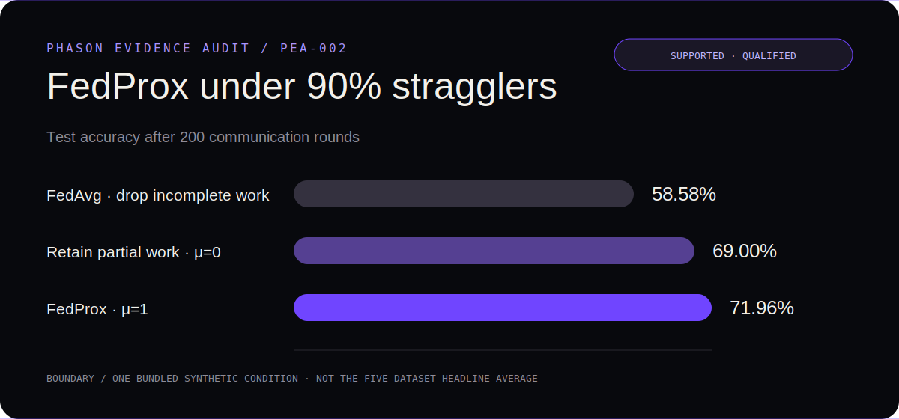

# Phason Evidence Audit 002 — FedProx

<p align="center"><strong>PHASON LABS / INDEPENDENT EVIDENCE AUDIT</strong></p>
<p align="center">
  
  <a href="https://github.com/AparajeetS/phason-evidence-audit-PEA-002-fedprox/actions/workflows/verify-evidence.yml"></a>
  
  
</p>



<p align="center"><a href="REPORT.md"><strong>Full technical report</strong></a> · <a href="RUN_LOG.md">Run ledger</a> · <a href="evidence-manifest.json">Evidence manifest</a> · <a href="AUDIT_STANDARD.md">Audit standard</a></p>

> **Executive decision:** the independent reproduction recovered the claimed method ordering in the hardest bundled synthetic condition. Retaining partial work added 10.42 accuracy points and the proximal term added 2.95 more. This scoped result does not establish the paper’s five-dataset headline average.

## Evidence package

| Layer | What is pinned here |
| --- | --- |
| Claim | FedProx advantage under severe systems heterogeneity |
| Source | Upstream repository and exact commit `d2a4501` |
| Execution | 200 communication rounds under 90% stragglers |
| Record | Round-level curves, summary table, environment metadata |
| Integrity | SHA-256 manifest plus automated verification workflow |
| Corrections | Versioned correction issue form for authors and maintainers |

An independent, no-fee reproducibility audit of the open-source artifact for:

> Li et al., *Federated Optimization in Heterogeneous Networks* (MLSys 2020)

- Original repository: <https://github.com/litian96/FedProx>
- Paper: <https://arxiv.org/abs/1812.06127>
- Audited source commit: `d2a4501f319f1594b732d88315c5ca1a72855f50`
- Audit date: 2026-07-16
- Auditor: Aparajeet Shadangi, Phason Labs

## Verdict

**Supported with qualifications.** On the bundled `Synthetic(1,1)` data and the paper's most heterogeneous setting (90% stragglers), a modern independent reproduction recovered the claimed ordering:

| Method | Test accuracy after 200 rounds |
| --- | ---: |
| FedAvg, drop stragglers | 58.58% |
| Retain partial work, μ=0 | 69.00% |
| FedProx, μ=1 | 71.96% |

Retaining partial work added **10.42 percentage points** and the proximal term added another **2.95 points** in this run. This supports the paper's qualitative claim for the hardest bundled synthetic condition.

It does **not** independently establish the headline “22% on average” figure, which aggregates five datasets. The released TensorFlow 1.10 environment is no longer directly installable on a current Python stack, and this audit did not rerun the four larger real-data experiments.

Read the full [report](REPORT.md), [run log](RUN_LOG.md), and generated [results](results_minibatch200_drop90/summary.csv).

## Reproduce the audit

Clone the original repository beside this one, then run:

```bash
python audit.py \
  --source /path/to/FedProx \
  --output results_minibatch200_drop90 \
  --rounds 200 --eval-every 10 \
  --seeds 0 --drops 0.9 \
  --epochs 20 --batch-size 10
```

The broader three-seed solver-sensitivity run is:

```bash
python audit.py \
  --source /path/to/FedProx \
  --output results \
  --rounds 200 --eval-every 10 \
  --seeds 0 1 2 --drops 0 0.5 0.9 \
  --epochs 20 --batch-size 0
```

`--batch-size 0` intentionally changes the local solver to deterministic full-batch gradient descent. It is a stress test, not a paper-faithful reproduction.

## Scope and tone

This is an artifact audit, not an allegation of misconduct. It distinguishes the paper's historical result from the present-day usability of its public reproduction path and invites corrections from the maintainers.

## License

Audit code and report: MIT. The original FedProx code and bundled data remain governed by their upstream terms and are not redistributed here.

---

### Need an independent answer before you ship or publish?

Phason Labs runs tightly scoped ML evidence audits with a reproducible record, an explicit verdict, and a private correction window. [Request an audit](mailto:aparajeet.shadangi@proton.me?subject=Independent%20evidence%20audit%20enquiry).
